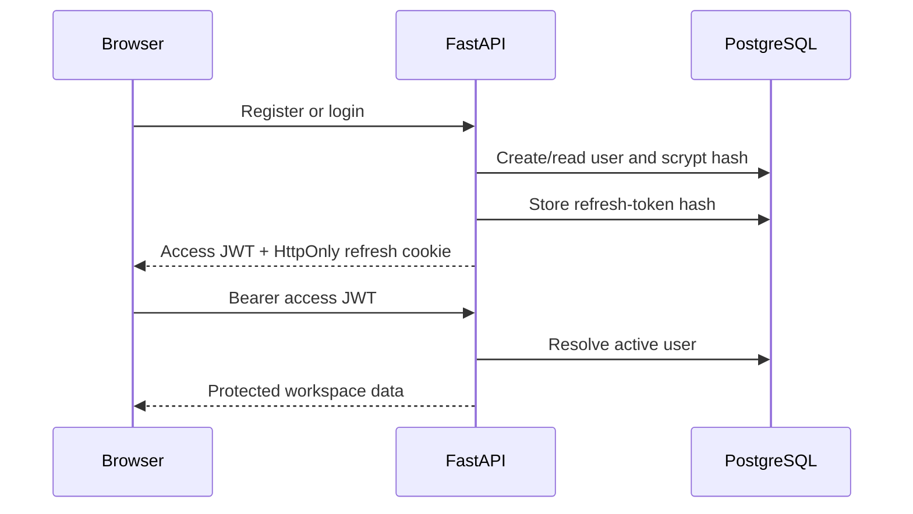
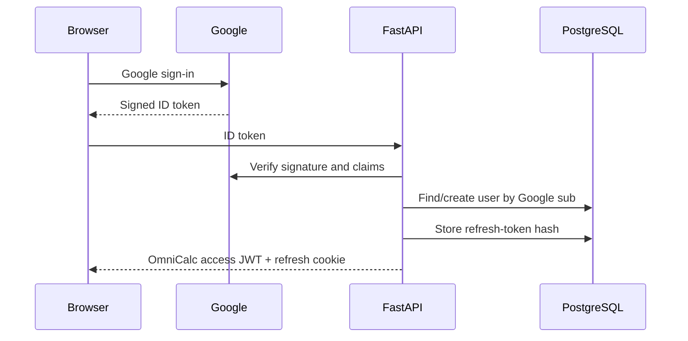

# Authentication

OmniCalc supports local email/password registration and Google Identity Services sign-in. Both flows finish by issuing an OmniCalc access JWT and refresh JWT; Google credentials are not used as the long-term application session.

## Components

| Component | Responsibility |
|---|---|
| `frontend/src/auth/AuthScreen.jsx` | Registration, login, and Google sign-in UI |
| `frontend/src/auth/GoogleSignIn.jsx` | Loads Google Identity Services and receives a one-time ID credential |
| `frontend/src/auth/AuthContext.jsx` | Restores and exposes the current application session |
| `frontend/src/api.js` | Adds the bearer token, sends the refresh cookie, and performs one refresh/retry |
| `backend/app/auth/router.py` | Registration, login, Google exchange, refresh rotation, logout, and profile lifecycle |
| `backend/app/auth/security.py` | scrypt password hashing, HS256 JWT signing/validation, refresh-token hashing |
| `backend/app/auth/google_identity.py` | Google signature and identity verification |
| `backend/app/auth/dependencies.py` | Required and optional bearer-token resolution |
| `backend/app/storage.py` | PostgreSQL or development-memory persistence |
| `refresh_tokens` table | Stores session IDs and hashes, never raw refresh tokens |

## Local credential flow

Registration normalizes the email, enforces password length and character classes, creates a random 16-byte salt, and derives a 32-byte password hash with scrypt. Login returns the same public failure for an unknown email or wrong password.

## Google flow

The backend checks the expected Web Client ID (`aud`), accepted Google issuer, expiration/signature, stable `sub`, email, and `email_verified`. The immutable Google `sub` is the external identity key; email is not used as that key. An existing local account with the same email is not silently linked.

Reference: [Google: Verify the Google ID token on your server side](https://developers.google.com/identity/gsi/web/guides/verify-google-id-token).

## Token lifecycle

| Artifact | Browser location | Server storage | Default life | Purpose |
|---|---|---|---:|---|
| Password | Submitted over HTTPS only | Salted scrypt hash | Until changed/deleted | Local authentication |
| Google ID token | Held for the exchange request | Not stored | Google-controlled | Prove Google identity once |
| Access JWT | `sessionStorage` | Not stored | 15 minutes | Bearer authorization |
| Refresh JWT | `HttpOnly`, `Secure` cookie in production | SHA-256 hash only | 30 days | Obtain a new session pair |

Access and refresh JWTs are HS256 signed and contain `sub`, `type`, `sid`, `jti`, `iss`, `aud`, `iat`, `nbf`, and `exp`. The decoder fixes the allowed algorithm and validates signature, token type, issuer, audience, activation, expiry, subject, and session ID.

On refresh, the API validates the cookie JWT, loads its session, compares the stored and presented hashes in constant time, revokes the used session, then issues a new pair with a new session ID. Reuse of a revoked or mismatched refresh token revokes all sessions for that user. Logout revokes the presented refresh session and clears the cookie. An issued access token remains valid only until its short expiry.

## Authorization and data isolation

`current_user` resolves the bearer subject to an active database user. History and workflow queries always include that user ID in the SQL predicate. A user cannot list, delete, or clear another user's records by supplying another record ID.

The calculation endpoint accepts optional authentication for direct API use; an authenticated result is persisted to that user's history. The shipped web workspace requires sign-in.

## Browser protections

- CORS uses explicit origins and credentials; wildcard origins are rejected in production.
- Authentication requests with an `Origin` header must match `ALLOWED_ORIGINS`.
- The refresh cookie is `HttpOnly`, `Secure` in production, scoped to `/api/v1/auth`, and defaults to `SameSite=Lax`.
- The access token is not placed in persistent local storage or a script-readable cookie.
- The same-origin production proxy removes the need for a cross-site refresh cookie.

## Deliberate limitations

- Password reset and outbound email verification need a transactional email provider and are not fabricated without one.
- Automatic account linking is disabled. A future linking flow must require authentication with both providers.
- Rate limiting should also be enforced at the public gateway because an in-process counter is unreliable across replicas.
